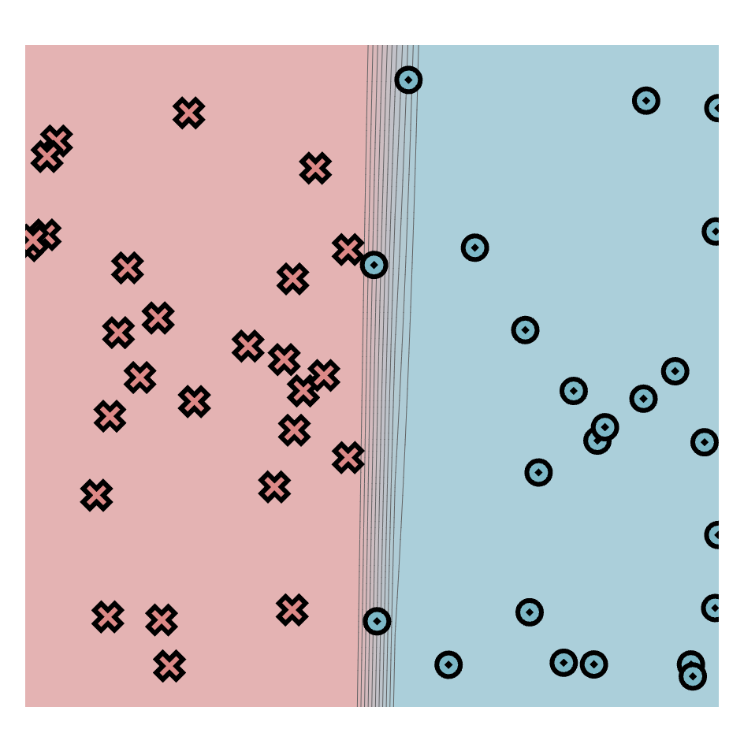
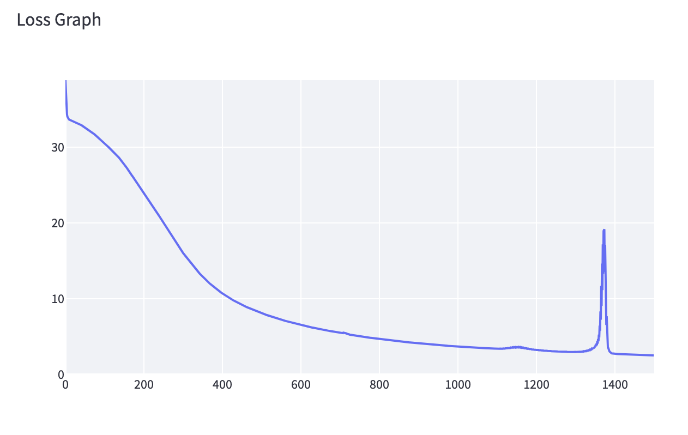

[](https://classroom.github.com/a/YFgwt0yY)
# MiniTorch Module 2


* Docs: https://minitorch.github.io/

* Overview: https://minitorch.github.io/module2/module2/

This assignment requires the following files from the previous assignments. You can get these by running

```bash
python sync_previous_module.py previous-module-dir current-module-dir
```

The files that will be synced are:

        minitorch/operators.py minitorch/module.py minitorch/autodiff.py minitorch/scalar.py minitorch/scalar_functions.py minitorch/module.py project/run_manual.py project/run_scalar.py project/datasets.py


Simple Dataset:
Hidden layers =  2
Learning rate =  0.1
Number of Epochs = 1000
Time per epoch = 0.025s


[Click here to view the Simple Dataset training Log](training_data/simple_training.txt)

Diag Dataset:
Hidden layers =  2
Learning rate =  0.1
Number of Epochs = 600
Time per epoch = 0.025s


[Click here to view the Diag Dataset training Log](training_data/diag_training.txt)


Split Dataset:
Hidden layers =  6
Learning rate =  0.1
Number of Epochs = 1000
Time per epoch = 0.084s



[Click here to view the Diag Dataset training Log](training_data/split_training.txt)


Xor Dataset:
Hidden layers =  8
Learning rate =  0.1
Number of Epochs = 1500
Time per epoch = 0.129s



[Click here to view the Diag Dataset training Log](training_data/xor_training.txt)

